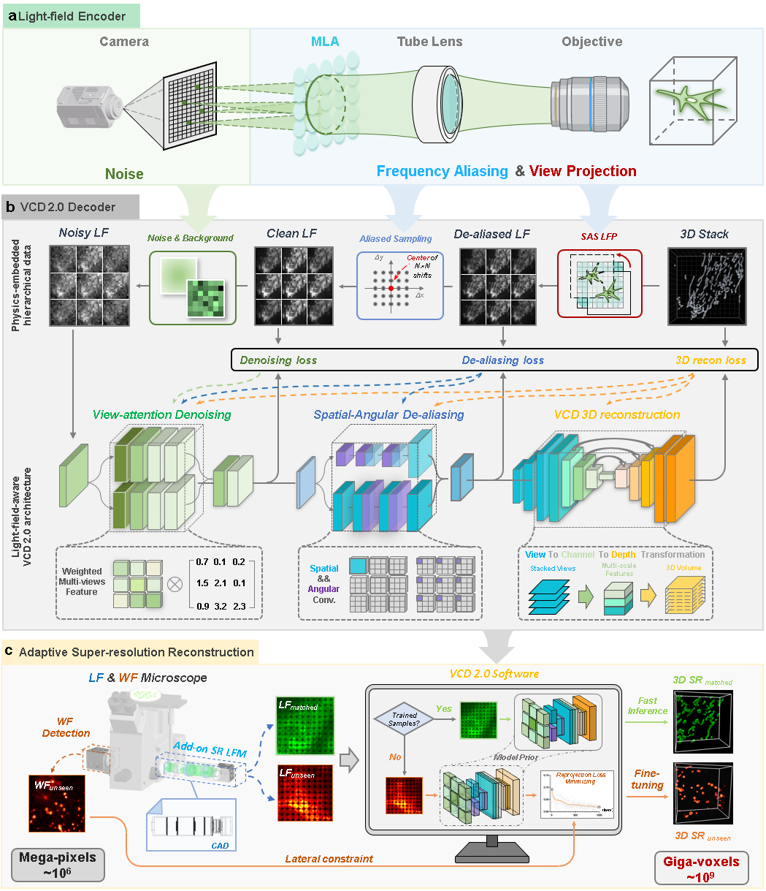

# VCD 2.0
This code accompanies the paper: 
\
[Sustained 3D isotropic imaging of subcellular dynamics using adaptive VCD light-field microscopy 2.0](https://www.biorxiv.org/content/10.1101/2023.03.15.532876v2)

# Contents
- [Overview](#overview)
- [System requirements](#Requirements)
- [Usage](#Usage)
- [Citation](#Citation)
- [Contact](#Contact)

# Overview
- ### Principle

- ### Metrics

# Requirements
- Windows 10. Linux should be able to run the code but the code has been only tested on Windows 10 so far.
- Python 3.7 +
- CUDA 11.1 and cuDNN 8.2.0
- Graphics: NVIDIA RTX 3090, or better
- Memeory: > 128 GB 
- Hard Drive: ~50GB free space (SSD recommended)
# Usage
### Workflow of VCD 2.0
* Tools under this directory are used to generate training data and build VCD 2.0 network for 3D super-resolution reconstruction in LFM. 
We provide a user-friendly GUI package for fast network construction, which consists of 
  * ***'main.mlapp***: *The main function of VCD 2.0 GUI which includes:*
  	* *‘DataPreparation.mlapp’*：*The sub-function for dataset pre-processing*
	* *‘NetworkTraining.mlapp’*：*The sub-function for network training*
	* *‘NetworkValidation.mlapp’*：*The sub-function for network validation*
	* *‘FineTuning.mlapp’*：*The sub-function for network fine-tuning*
  * ***Data***: *Store the processed data (e.g.training pairs)*
  * ***DL***: *The source code of VCD 2.0  (The trained model will be automatically saved at its sub-folders)*
  * ***source***: *light-field PSF matrix and example figures*
  * utils: *sub-functions of Matlab-based GUI*
* The workflow of this GUI is composed of 4 components:
  ① Dataset generation ② Network training ③ Network validation ④ Network fine-tuning.
 \
***Note: The detailed explanation of these components and corresponding operation process are all included in the [VCD 2.0 manual](/VCD%202.0%20manual.pdf)***
  \
  \

### Model inference for quick validation
   * After running environment installation (seen in Section 2,[VCD 2.0 manual](/VCD%202.0%20manual.pdf)), users can fast implement the [trained models](/DL/checkpoint) on our provided [validation data](/example/validation_data).
     The step-by-step illustration of this process are detailed in Section 3.4, "Network validation". The reconstruction results of example data are available at [Google Drive](https://drive.google.com/file/d/12gmTYRYSmYBnTj5Ha90yrMZVrBdFwLsv/view?usp=sharing).More details are seen in the [VCD 2.0 manual](/VCD%202.0%20manual.pdf)

# Citation
If you use this code and relevant data, please cite the corresponding paper where original methods appeared: 
\
Zhu, L. et al. Sustained 3D isotropic imaging of subcellular dynamics using adaptive VCD light-field microscopy 2.0. bioRxiv 2023.03.15.532876; doi: https://doi.org/10.1101/2023.03.15.532876
# Contact
Correspondence Should you have any questions regarding this code and the corresponding results, please contact Lanxin Zhu (zhulanxin1@hust.edu.cn)

